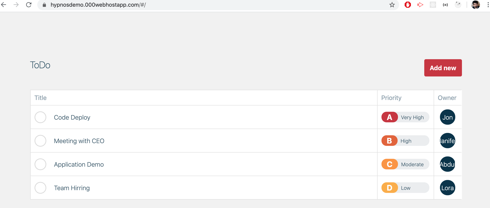
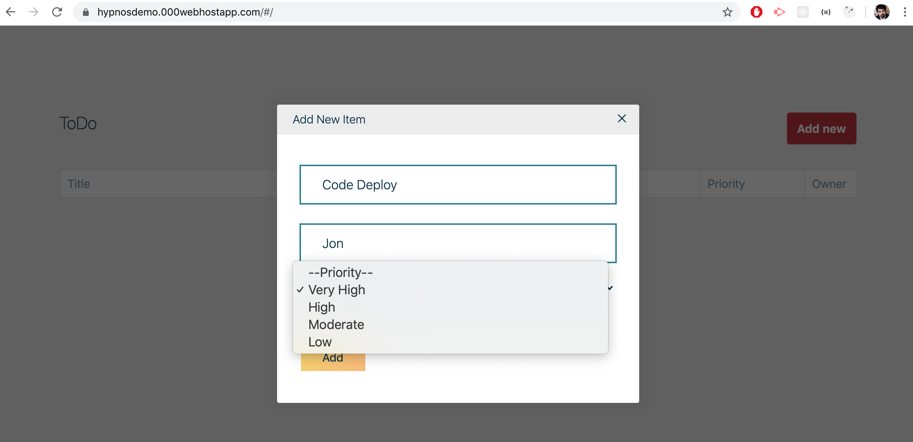
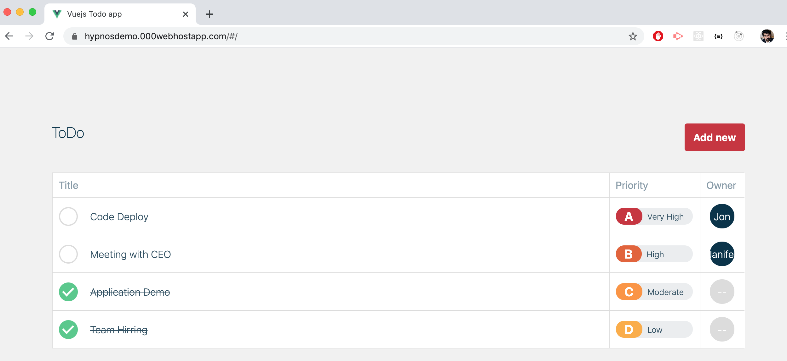

# Vuejs Todo App  📝
[](http://hits.dwyl.com/abdulwahab0/https://githubcom/AbdulWahab0/ToDos-App-vuejs)
## A clean, beautiful and responsive To do App for Vue.js Developers! 

<p align="center"> 
  <kbd>
  	<a href="https://hypnosdemo.000webhostapp.com/" target="_blank">
		</img>
	</a>
  </kbd>
</p>

## Demo Website
👉 Live Demo :https://hypnosdemo.000webhostapp.com/

Let me know if you have any questions. [Email Abdul Wahab ](mailto:wahab3060h@gmail.com)

## Sections 
✔️ Add the Task\
✔️ Delete the Task \
✔️ Check and uncheck Task\

## Add Task
<p align="center"> 
  <kbd>
  	<a href="https://hypnosdemo.000webhostapp.com/" target="_blank">
		</img>
	</a>
  </kbd>
</p>


## Delete/uncheck Task
<p align="center"> 
  <kbd>
  	<a href="https://hypnosdemo.000webhostapp.com/" target="_blank">
		</img>
	</a>
  </kbd>
</p>


## Technologies used 🛠️

- [Vue Js](https://vuejs.org/)

## Run Locally 🚀

- git clone git@github.com/AbdulWahab0/to-do-app-vuejs.git

## Project setup
```
npm install
```

### Compiles and hot-reloads for development
```
npm run serve
```

### Compiles and minifies for production
```
npm run build
```

### Run your unit tests
```
npm run test:unit
```
## Contributors ✨
<table>
  <tr>
    <td align="center"><a href="https://github.com/AbdulWahab0"><br /><sub><b>Abdul Wahab</b></sub></a><br /><a href="https://github.com/AbdulWahab0" title="Code">💻</a> <a href="https://github.com/AbdulWahab0" title="Documentation">📖</a> <a href="https://github.com/AbdulWahab0" title="Design">🎨</a> <a href="https://github.com/AbdulWahab0" title="Maintenance">🚧</a></td>
  </tr>
</table>
